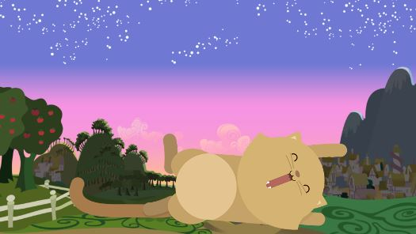
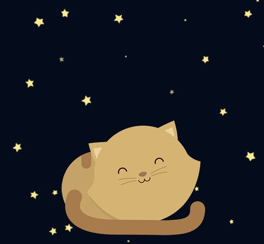
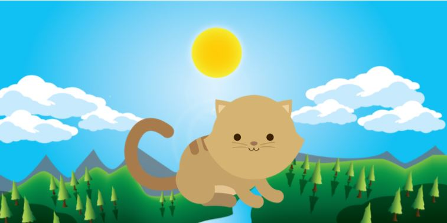
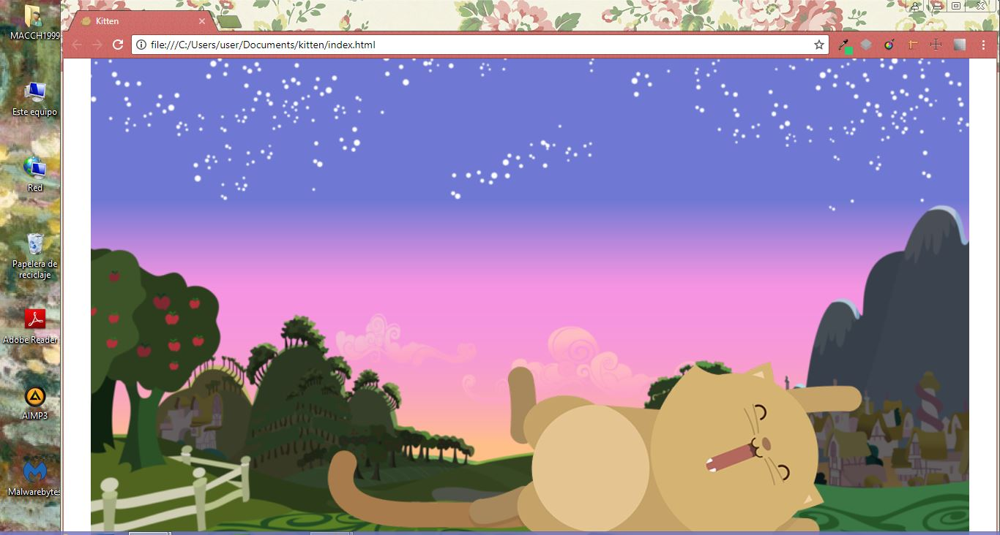
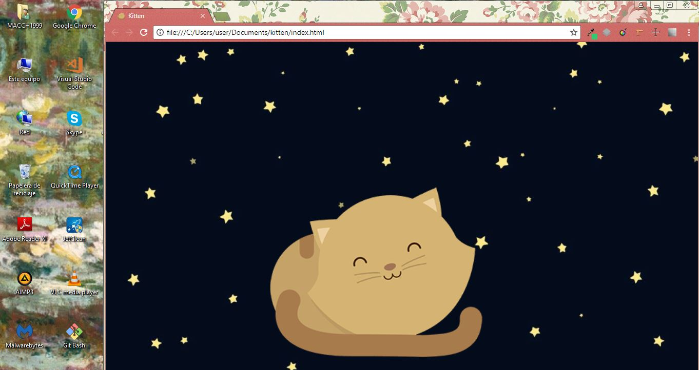
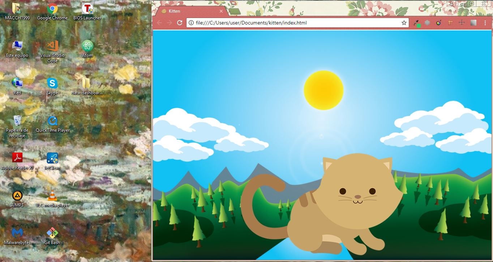

# Kitten

* **Track:** _Common Core_
* **Curso:** _Creando tu primera red social_
* **Unidad:** _La web desde un móvil_

***

Crea una página web donde se muestre un paisaje y un gatito diferente a medida que la ventana del navegador se haga más pequeña.

## Objetivos del reto

El reto consiste en:

* Crear una web que muestra un paisaje y un gatito diferente a medida que la ventana del navegador se haga más pequeña
* Usar Grid System y Media Query.
* Implementar `gh.pages`

## Logro

## Herramientas usadas

* HTML 

* CSS 

* Grid System 

* Media Query 
